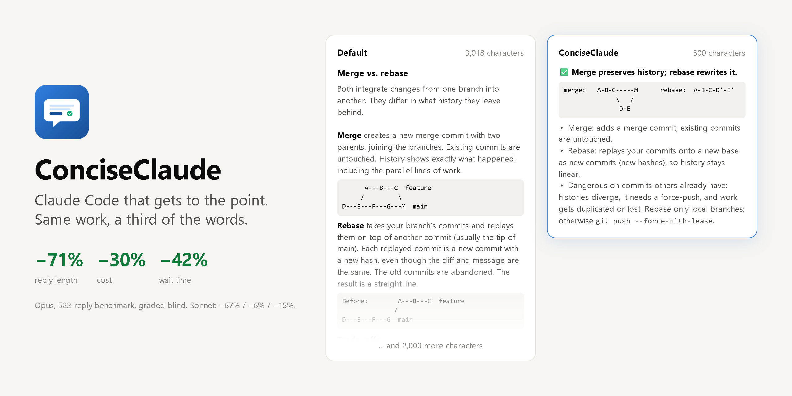
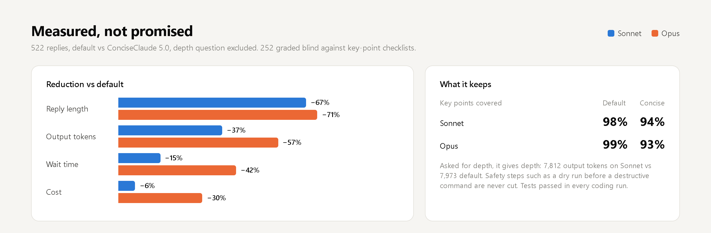

<p align="center">
  
</p>

<h1 align="center">ConciseClaude</h1>

<p align="center"><b>Claude Code that gets to the point. Same work, a third of the words.</b></p>

<p align="center">
  <a href="https://drknowhow.github.io/ConciseClaude/benchmark/"></a>
  <a href="CHANGELOG.md"></a>
  
  <a href="LICENSE"></a>
</p>

<picture>
  <source media="(prefers-color-scheme: dark)" srcset="assets/hero-dark.png">
  
</picture>

ConciseClaude is a Claude Code plugin that changes how much Claude **says**,
not how much it reads, thinks or checks. Replies open with the answer, and
the preamble, step-by-step narration and closing recap are gone. When you ask
for depth you get it, and errors, risks and safety steps are never trimmed.
Code comes without commentary, and a meter measures every reply so the rules
don't drift.

- **Shorter and faster.** On Opus, replies are 71% shorter, cost 30% less and
  arrive 42% sooner. On Sonnet: 67% shorter, 6% cheaper, 15% sooner.
- **Still complete.** A blind grader found 93–94% of the key points a full
  answer covers, against 98–99% for the default.
- **Measured.** A Stop hook scores every reply and nudges Claude when one runs
  long. `/conciseclaude:meter report` shows how it's doing.

<picture>
  <source media="(prefers-color-scheme: dark)" srcset="assets/results-dark.png">
  
</picture>

<p align="center"><a href="https://drknowhow.github.io/ConciseClaude/benchmark/"><b>Open the interactive benchmark →</b></a></p>

## Install
```
claude plugin marketplace add drknowhow/ConciseClaude
claude plugin install conciseclaude@conciseclaude
```
Start a new session. The Concise style is on in every session while the plugin
is enabled, even if you've chosen another output style. To turn it off, run
`claude plugin disable conciseclaude@conciseclaude`. The hooks need Python 3.8+
(`py -3`, `python3` or `python`) and `sh`, which Claude Code on Windows gets
from Git Bash. Without Python the rules still apply; replies just aren't
measured.

The rules target Sonnet and Opus. Haiku sessions skip the meter, the nudge
and the code rules, and the style tells Haiku to ignore it. Benchmarks found
no saving on Haiku, because most of its output is hidden thinking.

**Upgrade:** `claude plugin update conciseclaude@conciseclaude`, then restart.

**Diff meter:** in each repo you want measured, run `/conciseclaude:diff-hooks`.

**No plugins?** If your organization blocks plugins or marketplaces, use the
manual install: clone this repo, open Claude Code in it, and say **"Read
IMPLEMENT.md and implement it."** A manual install doesn't force the style;
it sets `outputStyle` in your settings instead.

### Moving from a manual install (3.x)
Remove the manual install before enabling the plugin. If you don't, every
reply is metered twice and the rules load twice.
1. In `~/.claude/settings.json`, delete the `Stop` and `UserPromptSubmit`
   entries that run `reply_shape.py`, and `"outputStyle": "Concise"`.
2. Delete `~/.claude/output-styles/concise.md`, `~/.claude/commands/v.md`,
   `~/.claude/commands/u.md`, `~/.claude/skills/human-prose/` and
   `~/.claude/hooks/reply_shape.py`.
3. Delete the `## Replies` block from `~/.claude/CLAUDE.md`. The plugin prints
   that pointer at session start.
4. Keep `~/.claude/hooks/diff_shape.py` until you've rerun
   `/conciseclaude:diff-hooks` in each repo that has the git hooks. The old
   shims call that file.

The reply log in `~/.claude/reply_shape/` stays where it is, so `report`
history carries over.

## What's in it
| Part | File | Job |
|---|---|---|
| Rules | `output-styles/concise.md` | The only copy of the reply rules: budget, reply grammar, cut list, never-cut list. Loads into the system prompt. |
| Code rules | `rules/code.md`, `hooks/code_rules.py` | Code, test and commit rules. A PostToolUse hook adds them on a session's first file edit, so chat-only sessions don't pay for them. |
| Pointer | `hooks/session_start.sh` | Prints the rules pointer at session start, so subagents and other surfaces find the rules and nobody writes a second set. `claude-md-snippet.md` is the same text for manual installs. |
| Meter | `hooks/reply_shape.py` | Stop hook measures each final reply. Prompt hook tells Claude when the previous one ran long. `hooks/run.sh` finds the Python to run it; `/conciseclaude:meter` reports. |
| Diff meter | `hooks/diff_shape.py` | Git `pre-commit` and `commit-msg` hooks, installed per repo by `/conciseclaude:diff-hooks`. Flags swallowed exceptions, dividers, forensic comments, docstrings longer than their body, comment-heavy diffs, oversized commits, and long or headed commit bodies. |
| One-turn stages | `commands/v.md`, `commands/u.md` | `/conciseclaude:v <ask>` lifts the budget for one reply. `/conciseclaude:u <ask>` squeezes it to 150 chars. |
| Plugin | `.claude-plugin/`, `hooks/hooks.json` | Manifest, one-plugin marketplace, and hook wiring. |
| Visuals | `assets/`, `docs/index.html`, `docs/benchmark/` | Icon and README images (HTML sources in `assets/src/`), and the GitHub Pages site with the interactive benchmark. |
| Writing pass | `skills/human-prose/SKILL.md` | For prose other people read: PR descriptions, docs, tickets, email. |
| Version | `VERSION`, `CHANGELOG.md` | One canonical version; `tests/test_version_sync.py` fails if any copy drifts. |
| Benchmark | `bench/ab.py` | Token, cost and speed A/B of style on vs off, using headless Claude Code. Not installed. |
| Tests | `tests/` | `python tests/test_reply_shape.py` and `python tests/test_version_sync.py` (or pytest). |

## What a reply looks like
```
✅ Fixed: token expiry compared naive local time against UTC.
auth/middleware.py:42 now uses datetime.now(timezone.utc); 118 tests pass.
Need you: ship to staging now, or wait for the Monday window?
```
Result line first with a status glyph. Detail only if it changes your next
move. Literals verbatim. **Need you:** last, and only when Claude is blocked on
you. Security, destructive commands, errors, and plans get 900 chars, but only
under a visible label like **Risk:** or **Plan:**.

## What code looks like
The same rule set covers the code Claude writes: a reviewer has about ten
minutes per commit. A comment states the invariant the next lines cannot
show; dates, PR numbers and probe results go in the commit body, which gets
eight lines. Docstrings are contracts, not histories. Guards sit at real
boundaries and never swallow. Nothing ships with zero non-test callers.

```
python ~/.claude/hooks/diff_shape.py scan             # what the meter says about the current tree, before installing\npython ~/.claude/hooks/diff_shape.py install          # in each repo: writes .git/hooks/pre-commit and commit-msg
python ~/.claude/hooks/diff_shape.py report --days 7  # commits measured, median comment share, findings by code
python ~/.claude/hooks/diff_shape.py mode block       # off | warn (default) | block on fail-class findings
```

## Why it's built this way
Each point comes from running an earlier version of this system.
- **One copy of the rules.** The earlier setup had three overlapping rules: "≤4
  lines", "≤5 lines", and "400 chars". Replies drifted toward the loosest one.
- **Characters, not lines.** Lines wrap differently in a terminal, an IDE panel,
  and a phone. Prose characters outside code and URLs track what you actually
  read. Table cells count too: moving text into a table doesn't make it
  shorter to read.
- **Exceptions are bounded and labeled.** An open-ended "never compress
  security, errors, planning, review" list covered most real work, so most
  replies qualified. Now the exception has a 900-char ceiling and needs a label,
  so taking it costs a visible word.
- **Measure at the output.** A rule nobody measures can't be tuned.
- **Never truncate.** Mechanical cutting would remove exactly the error text you
  needed.
- **Nudge before block.** Block mode makes Claude rewrite, but the rewrite lands
  *under* the long reply (rendered text can't be retracted), so you read both.
  Nudge only shapes the next reply.
- **Code rules by content, not length.** An audit of thirty Claude-authored
  commits (`docs/code-verbosity-audit-2026-09-20.md`) found 15–28% of added
  lines removable in three of four repos, almost all comments and docstrings,
  and eleven robustness defects under the prose. Length caps get gamed into
  denser code, so the diff meter fails on the defect signals (swallowed
  exceptions, forensic comments, dividers) and only warns on ratios.

## Evidence
**Controlled A/B, 2026-10-03** ([full write-up](docs/token-ab-2026-10-03.md)).
Headless Claude Code on Sonnet, with the style plus hooks on versus the
default style, in six-turn conversations run three times each:

| Conversation | Output tokens | Cost | Wall time |
|---|---|---|---|
| Ops troubleshooting | −34% | −11% | −14% |
| Schema design | −48% | −22% | −25% |
| Coding with tools | +5% | +2% | −7% |
| All | −28% | −9% | −16% |

It saves the most in conversation. In coding, tool calls and file contents
make up most of the output and aren't shortened, so the result there is a
wash. In single cold calls, output fell 13–18% but cost came out even,
because writing the prompt cache costs about as much as the shorter reply
saves. Reproduce with `python bench/ab.py`.

**Field log.** About 2,200 measured replies over two weeks on the original setup:

| Phase | IDE median prose chars | IDE replies over budget | Chat-app replies over budget |
|---|---|---|---|
| Rules + grammar only | 648 | 62% | 40% |
| Rules + grammar + nudge | 532 | 55% | 21% |

Read this as a trend, not a controlled test: the two phases had different
session mixes. The nudge helped, but IDE replies still ran over budget more
often than not. Labels weren't being gamed (8% of replies), but 70% of labeled
replies went past 900 anyway. If nudge isn't enough, switch to block.

The original version measured length only. This one also records when your
next prompt asks for **more** (`/v`) or **shorter** (`/u`). That's the check on
"concise without losing quality": if `asked_more` climbs while the median
falls, the budget is cutting substance, so raise it. Only the explicit
commands count. Phrases like "explain this" or "shorter" usually refer to the
code, not the reply, so matching them (as 1.x did) filled the report with
false signals. If you never type `/v` or `/u`, these columns stay at 0%. The original also silently skipped some replies
because it read the transcript before the final message was written. This
version reads the reply Claude Code hands the hook directly.

## Operating it
```
/conciseclaude:meter report --days 7        # median, p90, % over, asked_more, asked_shorter
/conciseclaude:meter mode block             # off | nudge (default) | block
/conciseclaude:meter diff report --days 7   # the diff meter's report
```
A manual install runs the same thing as `python ~/.claude/hooks/reply_shape.py report --days 7`.
- Budgets: the `BUDGETS` dict at the top of `reply_shape.py`.
- Rules: `output-styles/concise.md`, nowhere else. The plugin's copy is
  replaced on every update, so change the rules in a fork or a PR here, not in
  the plugin cache.
- Privacy: the log stores sizes, flags, and a 12-character hash per reply. No
  reply text.
- Off switch: `mode off` stops all feedback but keeps measuring. Removing the
  two hook entries stops measuring too.

## What it runs, stores and sends
Everything runs on your machine. ConciseClaude makes no network requests and
sends no telemetry.

- **Runs:** the hooks in `hooks/hooks.json`, each through `hooks/run.sh`,
  which starts the first Python 3.8+ it finds. At session start,
  `session_start.sh` prints the rules pointer. When you send a prompt and when
  a reply finishes, `reply_shape.py` measures the reply. After the first file
  edit in a session, `code_rules.py` adds the code rules. In Haiku sessions
  these hooks return without doing anything.
- **Stores:** `~/.claude/reply_shape/` holds the reply log (sizes, flags and a
  12-character hash per reply, never the reply text), the mode setting and
  small per-session markers. If you install the diff meter, it also uses
  `~/.claude/diff_shape/` (counts only, never code) and a copy of its script
  in `~/.claude/conciseclaude/`.
- **Writes outside those folders:** only when you run
  `/conciseclaude:diff-hooks` in a repo. That writes `.git/hooks/pre-commit`
  and `.git/hooks/commit-msg` there, and it won't overwrite a hook it didn't
  write.
- **Changes your settings:** no. The plugin forces its output style while
  it's enabled; disabling the plugin removes it.
